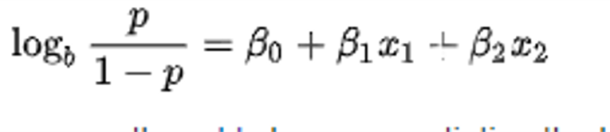
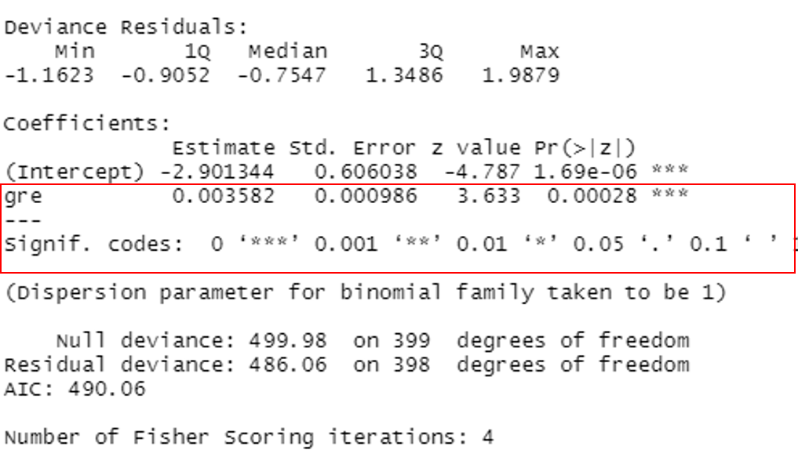
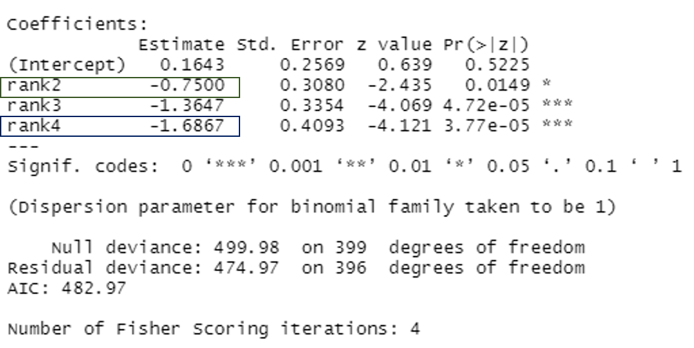

# Online Lecture 10

[TOC]

## Lecture 10

### Regression analysis

* **Linear model** = when the dependent variable is continuous (**you already learnt how to deals with that**)

* **Binary logistic regression** = when the dependent variable is binary (yes/no, admitted/rejected, sick/sane)

* **Multinomial logistic regression** = when the dependent variable is categorical with more than 2 levels 

### Logit Model (binomial logistic regression) 

A logit model (binomial logistic regression) **predict the outcome of a y variable who can take two value 0 and 1**

In a logit model (binomial logistic regression) the **independent variable** **χ** **are associate with a** **β** coefficient given **the intensity of the correlation** between log y and χ 

Therefore, to know the relation between y and x, we need an exponentiation **β**

**Binary Logistic Regression**: 

To analysis the influence of **a set of independent variables** on a **dependent variable which can only have two value (binary)**

### How to read a binomial regression result

Example#1: a continuous variable, `gre`, as independent variable

* `Estimate` gives the value of `β ` 

  For one unit change in GRE score **the chance to be admitted increase by** **exp(βgre)=1.003588**

  **or 0.03588%.** 

* `Pr(>|z|)` which is the **Wald z test** which says weather the **correlation** is statistically significant (similar with p-value???)

  Note that the `Signif. codes` is used for `Pr(>|z|)`.

Example#2: a categorical variable, `rank`, as independent variable

Here `rank` is the college prestige, which have 4 levels (rank1, rank2, rank3, rank4).

Here the basic outcome is the rank1 college. Therefore, the estimate is **the log odds of admission** (versus non admission) **compare with rank1 college**.
Therefore, compare with rank 1, if the respondent is in a rank2 university, he has **exp(βrank2)=exp(-0.75000)=0.472** chance to be admitted. In other words, **the chance decrease by 53%**

### Example of a model with several dependent variables

Read the ppt slides.

How to compare models?

Smaller AIC ==> Better model

Remark: AIC is considered as **significantly different** if the AIC is lowest by at least **two** units

Check the ppt slides for this (on-site) Lecture