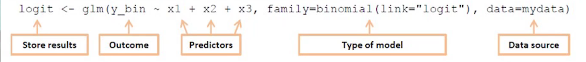
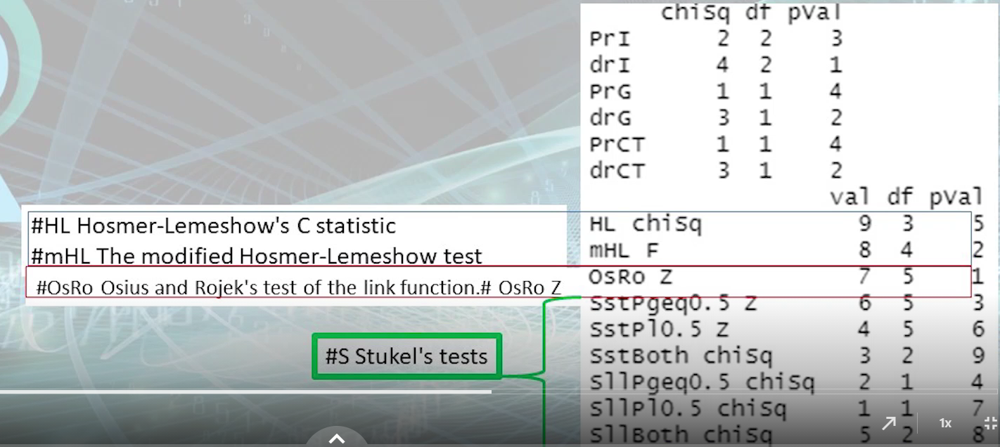
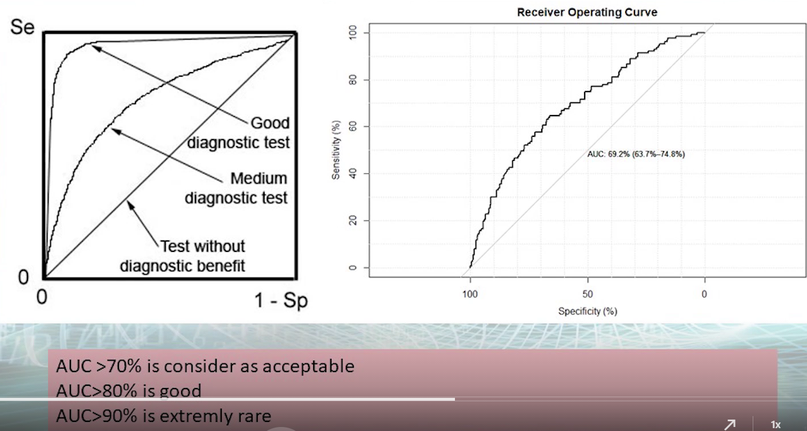

# Online Lecture 10

TOC:

* build binary regression model
* Test of goodness and fit
* Print your regression model

Packages used:

```R
library(glm2)
library(LogisticDx)  # for `gof()`
library(jtools)      # for `export_summs()`
```


## Building a binary regression model with the `glm` function

1. Store the results of a specific binomial model

   

   ```R
   logit <- glm(y_bin ~ x1 + x2 + x3, family = "binomial", data=mydata)
   
   #example
   #Admit = yes/no
   #Rank=Rank1/Rank2/Rank3/Rank4
   mylogitcategorical <- glm(admit ~ rank, data = mydata, family = "binomial")
   ```

2. Call the command `summary` to explore the results

   ```R
   summary(mylogitcategorical)
   # OR
   summ(mylogitcategorical) # in jtools package
   ```


## Test of goodness and fit

```R
library(LogisticDx)

gof(stored_binomial_model)

# By default, g=10
# If g=10 dose not work, just try other values of g
# gof(stored_binomial_model, g=8)
```



~~The p-value in all the 4 tests are > 0.05, so the model is strong enough.~~

(These p-values are not reliable. Only focus on **ROC** in `gof()`.)


We can also judge whether the model is good by **ROC** (Receiver Operating Curve)




## Print your regression model

```R
library(jtools)

export_summs(model1, model2, model3, scale=TRUE)

# example
export_summs(logitman1,logitman2,logitman3,scale=TRUE)
```

Note that R does not display the **basic outcome** (the level with which other levels are compared).


How to interpret the results?

* Pseudo R2: greater ==> better model
* AIC: smaller ==> better model