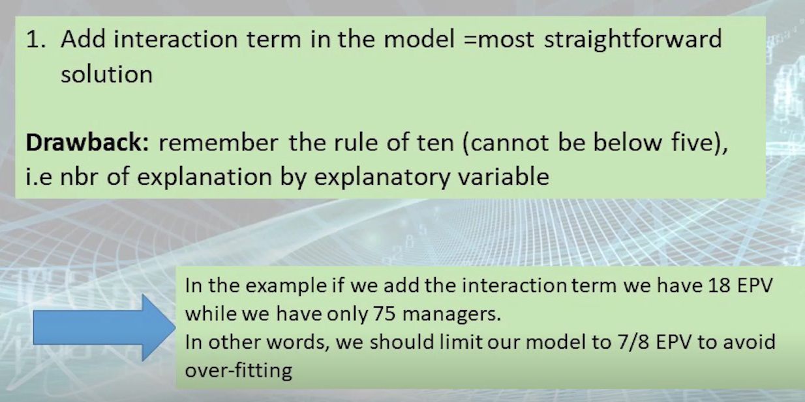
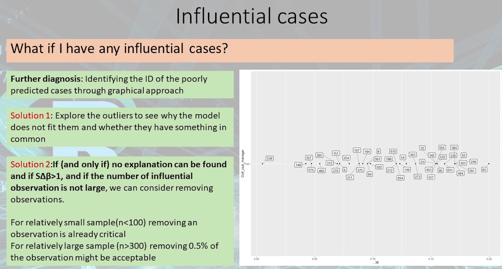
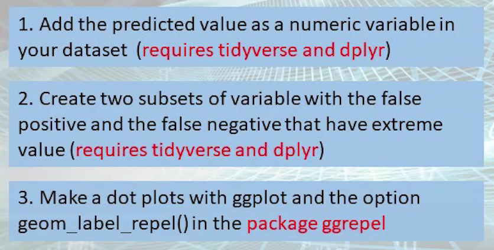
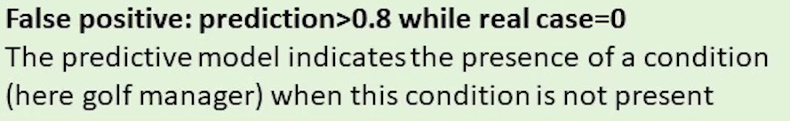
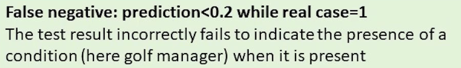

(This part will not be covered in the final exam!)


[TOC]

# Online Lecture 11 - What to do when assumptions are not matched

### What if we have collinearity

Many different possible solutions:

1. Not an issue if you have **collinearity** for control variables (those who are not statistically significant)
2. **Remove** one variable if the variable literally measure the same thing (we need to decide which variable to remove and which variable to keep in the model)
3. ~~Create a **score variable**~~ (not covered in lecture)


### What if we have additivity

Add interaction term in the model (most straightforward solution)

This solution has drawback:




### What if we have linearity (in the log odds)

Run the Box-Tidwell by adding an interaction term x(logx)

**Solution 1**: Transform the continuous variable with a log, square, square root, etc.

e.g. $log(income)$, $Age^2$ 


In this case, this solution does not work.


**Solution 2**: Split into *quintiles (5 parts)* ---- convert continuous variable into categorical variable

```R
# create a new variable in the dataset
library(gtools) # for `quantcut()`
CGA_golf_train_short$age_quantile <- quantcut(CGA_golf_train_short$age)

# make a new model and look at the coefficient
logitman6 <- glm(Golf_club_manager ~ age_quantile + Sex + diploma + Handicap, data=CGA_golf_train_short, family="binomial")
```


~~**Solution 3**~~ (not covered in the course)


### What if we have influential cases




**Step 1**: Identifying the ID of the poorly predicted cases through graphical approach



(`false positive` ==> the real value is NO, but predicted by our model as YES)

```R
library(tidyverse)
library(dplyr)

library(ggplot2)
library(ggrepel)
```


**Step 1.1**: ...

```R
# 1.1
logitman_slide21 <- glm(Golf_club_manager ~ Year_experience_as_trainer + Sex + diploma2 + Handicap_5cat, data=CGA_golf_train_short, family="binomial")

CGA_golf_train_short$predict_slide21 <- predict(logitman_slide21, type="response")

# do not work!!!
```

Only works when you have no missing value in the model. (We will learn what to do if there are missing values in later lecture)


**Step 1.2**: ...

Two types of poorly predicted cases:



i.e. the model predicts to be YES, but in reality it is NO

```R
# 1.2
logitman_slide21_false_positive <- filter(CGA_golf_train_short, Golf_club_manager=="No" & predict_slide21 > 0.8)
```



```R
# 1.2
logitman_slide21_false_negative <- filter(CGA_golf_train_short, Golf_club_manager=="Yes" & predict_slide21 < 0.2)
```


**Step 1.3**: ...

```R
ggplot(logitman_slide21_false_positive, aes(x=predict_slide21, y=Golf_club_manager))+
  geom_point()+
  geom_label_repel( aes(label=ID) )

# We will get an empty graph ==> no false_positive in this case
```

```R
ggplot(logitman_slide21_false_negative, aes(x=predict_slide21, y=Golf_club_manager))+
  geom_point()+
  geom_label_repel( aes(label=ID) )

# We can find many poorly predicted cases in the graph
```

After "step 1" is done, we should follow the "solution 1" (explore the outliers...) and change the model (some variables are missing; need to add some interaction terms `var1:var2`).

If this does not work, carefully consider deleting a few observations ("solution 2").