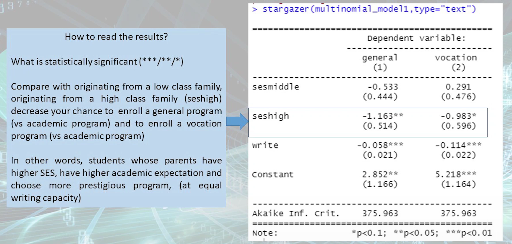
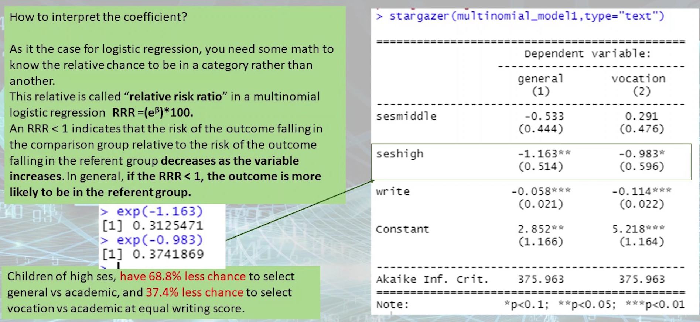
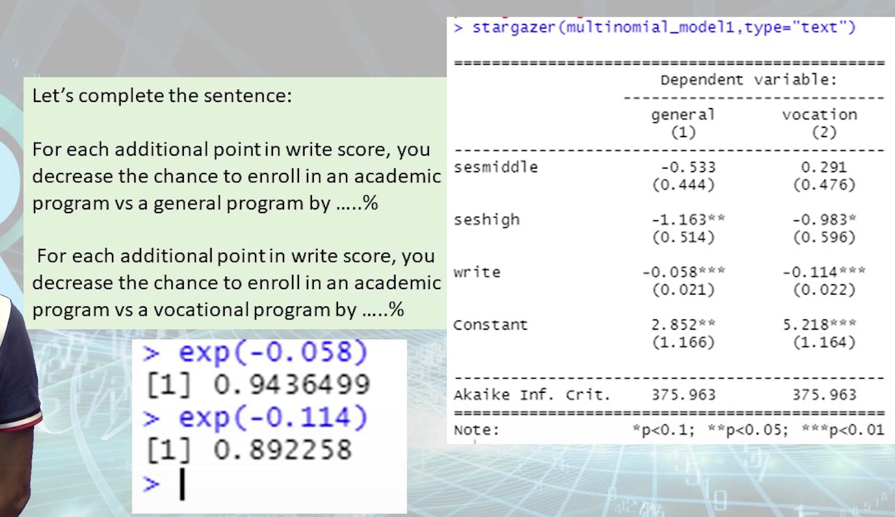
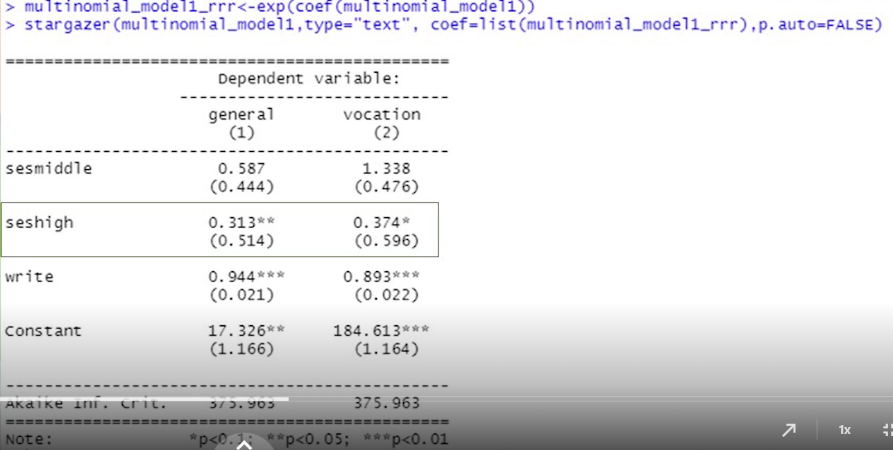

# Online Lecture 12 - Multinomial Logistic Regression

## Online Lecture 12

Multinomial Logistic Regression:

The dependent variable is categorical and has > 2 levels


```R
library(nnet)
library(stargazer)
```


```R
# determine the basic outcome
# ==> create a new variable with the desire reference level
df$dep_var_2 <- relevel(df$dep_var, ref="level_name")

ml$prog_2 <- relevel(ml$prog, ref = "academic")

# create the model
stored_model <- multinom(df$basic_outcome ~ ind_var1 + ind_var2 + ind_varn, data=data_name)

multinomial_model1 <- multinom(ml$prog_2 ~ ses + write, data = ml)
#multinomial_model1 <- multinom(prog_2 ~ ses + write, data = ml) # ???
# different from `glm()` you should define the basic outcome

summary(multinomial_model1)
stargazer(multinomial_model1, type="text")
```

The dependent variable `prog` have 3 levels: academic, vocation, general

If `academic` is your basic outcome, the model will return a comparison `academic` vs `general` and `academic` vs `vocation`.


How to read the `summary(multinomial_model1)`

==> p-value is not provided

==> use `library(stargazer)` to obtain readable outputs

==> `stargazer(multinomial_model1, type="text")`

==> How to read?



(AIC is given at the bottom)



(Typo: "37.4%" should be replaced by "62.6%")



Instead of doing `exp()` manually, how to report RRR using `stargazer`?

```R
# 1. Create an object which include the RRR 
multinomial_model1_rrr <- exp( coef(multinomial_model1) )

# 2. Report RRR using stargazer
stargazer(multinomial_model1, type="text", coef=list(multinomial_model1_rrr), p.auto=FALSE)
```




We build in total 3 models... If we simply choose the model with lowest AIC for interpretation, we may get wrong conclusion! We need to refer to the sociohistorical context to provide insightful explanation.


## Tutorial 12

### Test the goodness and fitness of a model

```R
#The two tests below might need to creat a subset where there is no Na using na.omit
GSS_na_omit <- na.omit(GSS_employment_status_simplified_V1)
GSS_na_omit$ref_level_full_time <- relevel(GSS_na_omit$wrkstat_2, ref="working fulltime")
Model_1_bis <- multinom(data=GSS_na_omit, GSS_na_omit$ref_level_full_time ~ sexnow + age + degree)
stargazer(Model_1_bis, type="text")
```

#### Test #1 (The Hosmer and Lemershow test)

```R
library(generalhoslem)
logitgof(GSS_na_omit$ref_level_full_time, fitted(Model_1_bis), g=10)
#no evidence of poor fit if p-value is up to 0.05 / it is the case here --- p-value = 0.7333
```

For this test if the **p-value** is small, **below 0.05**, it means that there is a **poor fit**. 


#### Test #2 (The Pseudo R Square test in logistic regression)

```R
library(DescTools)
PseudoR2(Model_1_bis, which="all")
# report the McFadden adjusted R2, the AIC and the BIC of the model
```

Look at `McFadden` (第一个).

When the Mc Fadden’s R² is **0.2 to 0.4**; it represents an excellent fit (**very good**), while closer from 1 is the better. In Social science, a Mc Fadden’s R² =0.1 will be already consider as a quite acceptable, though it is not very strong.

Mc Fadden’s R² **> 0.1** ==> the model is acceptable


### Create a classification table / confusion matrix

The above two tests only provide information about the **general fitting** of the model. ===> We need **classification table**.

```R
library(summarytools)
ctable <- table(GSS_na_omit$wrkstat_2, predict(Model_1_bis))
#table(GSS_na_omit$wrkstat_2, predict(Model_1_bis))           # do this directly

#table(GSS_na_omit$ref_level_full_time, predict(Model_1_bis))  # this one is easier to read
```

```R
                   working fulltime keeping house not working working parttime
  keeping house                  81            19           0                0
  not working                    53             2           0                0
  working fulltime              545             9           0                0
  working parttime              111             7           0                0
```

* Row: prediction
* Column: real

e.g. To interpret Row 1: Among those `keeping house` people, the model predict 19 of them correctly as `keeping house`; but 81 of them are wrongly predicted as `working fulltime`.


Q3.6

... where degree high school will be the basic outcome of the variable degree, and where “white” will be basic outcome...

```R
GSS_na_omit$degree_reordered <- ordered(GSS_na_omit$degree, levels=c("lt high school","high school","junior college","bachelor","graduate"))

GSS_na_omit$race_reordered <- ordered(GSS_na_omit$race, levels=c("white","black","other"))

Model_8 <- multinom(data=GSS_na_omit, GSS_na_omit$ref_level_full_time ~ sexnow + age_sq + degree_reordered + race_reordered + childs_2)

stargazer(Model_8, type="text")

table(GSS_na_omit$wrkstat_2, predict(Model_8))
```

---

`Tutorial 12 - additional notice.docx`

