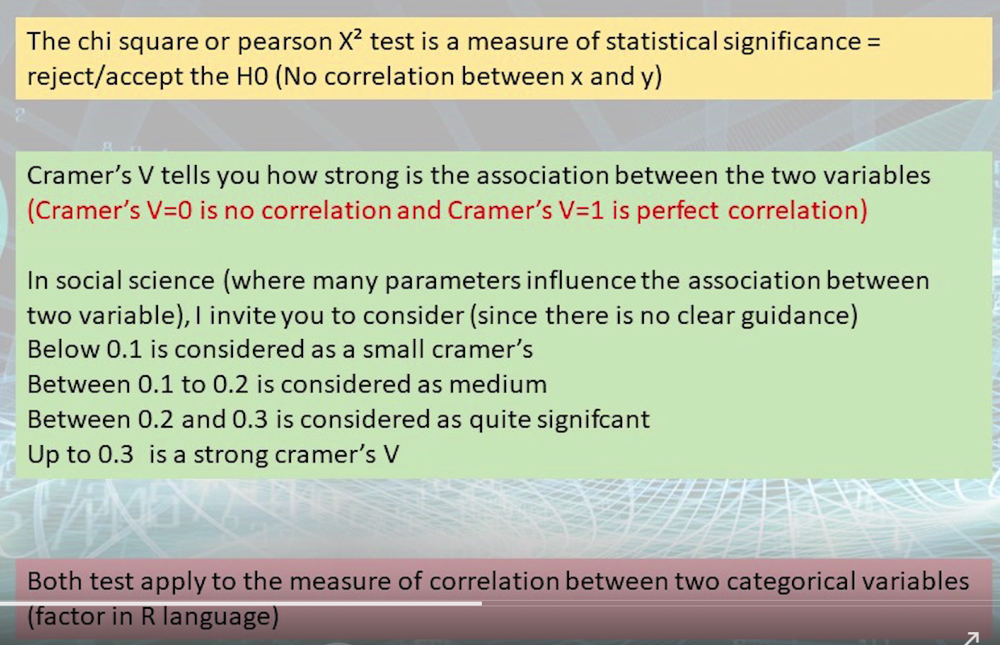

# Online Lecture 8 - Bivariate analysis - cross tabulation

Packages used

```R
library(gmodels) # for `CrossTable()`
library(sjstats) # for cramer'V test - `crosstable_statistics()`
library(sjPlot) # for `sjPlot::sjt.xtab()`
```

---

```R
CrossTable(data$x, data$y)
CrossTable(data$x, data$y, prop.t=FALSE, prop.chisq=FALSE)
```

**expected**: If `TRUE`, chisq will be set to `TRUE` and expected cell counts from the chisq will be included **(next lec)**

**prop.r**: If `TRUE`, row proportions will be included

**prop.c**: If `TRUE`, column proportions will be included

**prop.t**: If `TRUE`, table proportions will be included

**prop.chisq**: If `TRUE`, chi-square contribution of each cell will be included **(next lec)**


**chi square / pearson X^2 test**: correlation between the two (categorical) variables

```R
CrossTable(data$x, data$y, chisq=TRUE) # see p-value
```


Do we have other test methods to examine the correlation between two variables?

**chisq**: If `TRUE`, the results of a chi-square test will be included

**fisher**: If `TRUE`, the results of a Fisher Exact test will be included

**mcnemar**: If `TRUE`, the results of a McNemar test will be included

```R
CrossTable(data$x, data$y, fisher=TRUE) # only apply to 2*2 table
```

---

cramer'V ==> **how strong** the correlation is



```R
library(sjstats)

crosstable_statistics(df, x1=varname1, x2=varname2, statistics=c("cramer"))
```

---

The outputs of previous `CrossTable()` and `crosstable_statistics()` is not good looking

===> want beautiful table that is ready to publish

```R
library(sjPlot)

sjPlot::sjt.xtab(df$var1, df$var2) # only show frequency

sjPlot::sjt.xtab(df$var1, df$var2, show.row.prc=TRUE, show.col.prc=TRUE)
```


# Tutorial 8

$H_0$ = null hypothesis (i.e. the two variables are independent?)

If p-value < 0.05, we can reject $H_0$ with 95% confidence. 

In other words, if p-value < 0.05, the two variables are statistically correlated.


You may check the `.docx` file of Week 8 for more info of the above three statistic tests, but that will not help much.