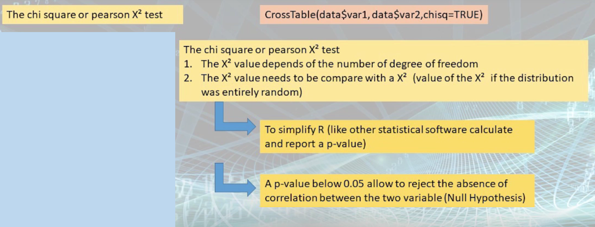

# Online Lecture 8 - Bivariate analysis - cross tabulation

package used

```R
library(gmodels) # for `CrossTable()`
```


```R
CrossTable(data$x, data$y)
CrossTable(data$x, data$y, prop.t=FALSE, prop.chisq=FALSE)
```

**expected**: If `TRUE`, chisq will be set to `TRUE` and expected cell counts from the chisq will be included **(next lec)**

**prop.r**: If `TRUE`, row proportions will be included

**prop.c**: If `TRUE`, column proportions will be included

**prop.t**: If `TRUE`, table proportions will be included

**prop.chisq**: If `TRUE`, chi-square contribution of each cell will be included **(next lec)**


**chi square / pearson X^2 test**: correlation between the two (categorical) variables

```R
CrossTable(data$x, data$y, chisq=TRUE) # see p-value
```



Do we have other test methods to examine the correlation between the two variables?

30:05​