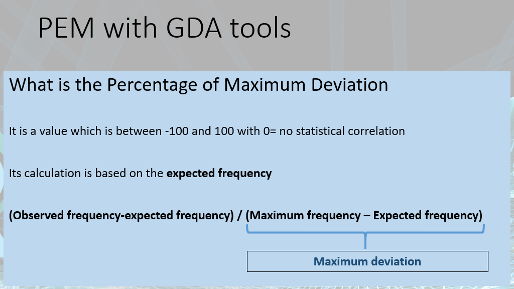

# Online Lecture 9 - Local correlation in cross tables

Packages used

```R
# same packages as last week
library(gmodels) # for `CrossTable()`
library(sjstats) # for cramer'V test - `crosstable_statistics()`
library(sjPlot) # for `sjPlot::sjt.xtab()`

library(GDAtools) # for `pem()`
```

---

## Expected Frequency + Chi-square contribution

Chi-square contribution in `CrossTable(data$x, data$y)` 


**expected**: If `TRUE`, chisq will be set to `TRUE` and expected cell counts from the chisq will be included **(this lec)** 

**prop.r**: If `TRUE`, row proportions will be included

**prop.c**: If `TRUE`, column proportions will be included

**prop.t**: If `TRUE`, table proportions will be included

**prop.chisq**: If `TRUE`, chi-square contribution of each cell will be included **(this lec)** 


Expected Frequency = (Row Total * Column Total) / N

```R
CrossTable(data$x, data$y, expected=TRUE)
```


We can also show **Expected Frequency** in `sjPlot::sjt.xtab()` by adding `show.exp = TRUE` 

```R
sjPlot::sjt.xtab(df$var1, df$var2, show.exp=TRUE)

#sjPlot::sjt.xtab(df$var1, df$var2, showExpected=TRUE) # old version
```


## PEM (Percentage of Maximum Deviation)

Details of **PEM** => between **-100 and 100**, where **"0"** shows that there is **no statistical correlation**. 

The equation of PEM is important!

* If PEM > 0, `observed` > `expected` 
* If PEM < 0, `observed` < `expected` 



See `Online9 ppt` Page 20 and 21 for an example of how to calculate **expected frequency** and **PEM**.


How to calculate PEM by R?

```R
library(GDAtools)

pem(df$var1, df$var2)

# In old version of `GDAtools`
#x <- table(df$var1, df$var2) # create an object and saved as a table
#pem(x)
```

About PEM value:

* < 10%: not a significant deviation
* 10% ~ 15%: a small but significant deviation
* 15% ~ 30%: strong deviation
* more than 30%: very strong deviation


# Tutorial 9

**Transform all characters variables into factor variables**

```R
library(magrittr) # for `%>%`
library(dplyr) # for `mutate_if()`

df <- df %>% mutate_if(is.character,as.factor)
```


**How to interpret PEM value?**

See example in `Tutorial-9_script.R` 

Line 23-24

> The parents who are **intermediate** profession have an slightly **higher** (pem=6.5) propension to **always** supervise their child homework;
> and are **less likely** (**negative pem** = -20.1) to **never or almost never** tutor their child homework. ("less likely" ==> amendment by me)

```R
pem(millemium_2015_study$class,millemium_2015_study$help)
```

```
$peml
                    always usually sometimes never or almost never
Hi manag/prof         -3.7    -2.5      -1.0                   3.1
Lo manag/prof          0.1     1.7      -1.2                 -10.5
Intermediate           6.5    -2.4      -8.2                 -20.1
Small emp and s-emp  -11.6     2.8       1.4                   1.4
Low sup and tech      -3.5     2.2       0.1                  -2.6
Semi routine          -5.3    -0.4       1.1                   3.1
Routine               -3.3    -9.5       4.1                   1.5

$pemg
[1] 4.8
```


Line 40 

> From the **pem** we can see that the son and daughter of higher professional are **less likely** to be bored at school (**-62.5%** for Never)
>
> （这句话好像又错了。。。应该是more likely吧。。）